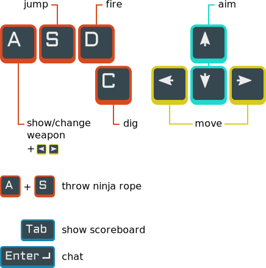

This is meant as a community-updated FAQ for [WebLiero](https://www.webliero.com).

To add a question create an issue or submit a pull request (all you need to know is Markdown syntax).

You can share this FAQ with the shortened URL [git.io/wlfaq](https://git.io/wlfaq)

## Index

* [General](#general)
  * [Which browsers support WebLiero?](#which-browsers-support-webliero)
  * [How is WebLiero different from the original MS-DOS Liero?](#how-is-webliero-different-from-the-original-ms-dos-liero)
  * [Does WebLiero support Gusanos/LieroX/OpenLieroX maps and/or mods?](#does-webliero-support-gusanoslieroxopenlierox-maps-andor-mods)
  * [Does WebLiero have bots?](#does-webliero-have-bots)
  * [Why doesn't WebLiero have mouse aim?](#why-doesnt-webliero-have-mouse-aim)
  * [Can WebLiero be played on mobile?](#can-webliero-be-played-on-mobile)
  * [Is WebLiero open-source?](#is-webliero-open-source)
  * [Does WebLiero have a changelog?](#does-webliero-have-a-changelog)
* [How to play](#how-to-play)
  * [What are the default WebLiero controls?](#what-are-the-default-webliero-controls)
  * [What are some popular alternative control schemes?](#what-are-some-popular-alternative-control-schemes)
  * [What are some lesser known tips on Liero controls?](#what-are-some-lesser-known-tips-on-liero-controls)
  * [How can I improve my aim?](#how-can-i-improve-my-aim)
* [Game modes](#game-modes)
  * [What game modes does WebLiero support?](#what-game-modes-does-webliero-support)
  * [Can I implement my own game modes?](#can-i-implement-my-own-game-modes)
* [Room List](#room-list)
  * [What are rooms with DED in their name?](#what-are-rooms-with-ded-in-their-name)
* [In-game chat](#in-game-chat)
  * [How do I open the chat window?](#how-do-i-open-the-chat-window)
  * [Can I tag players in chat?](#can-i-tag-players-in-chat)
  * [What are chat commands?](#what-are-chat-commands)
* [Maps](#maps)
  * [Does WebLiero support loading custom Liero maps?](#does-webliero-support-loading-custom-liero-maps)
  * [Does WebLiero support Liero powerlevels?](#does-webliero-support-liero-powerlevels)
  * [How can I create my own maps or edit existing ones?](#how-can-i-create-my-own-maps-or-edit-existing-ones)
  * [Where can I find Liero/WebLiero maps to download](#where-can-i-find-lierowebliero-maps-to-download)
* [Mods and modding](#mods-and-modding)
  * [Does WebLiero support loading custom mods?](#does-webliero-support-loading-custom-mods)
  * [Can WebLiero load original LIERO.EXE mods?](#can-webliero-load-original-lieroexe-mods)
  * [What can mods change in the game?](#what-can-mods-change-in-the-game)
  * [How can I make my own mods?](#how-can-i-make-my-own-mods)
  * [Where can I find WebLiero mods?](#where-can-i-find-webliero-mods)
* [Known issues](#known-issues)
  * [My \<insert action here\> key is stuck, how do I fix it?](#my-insert-action-here-key-is-stuck-how-do-i-fix-it)
  * [My worm spawned inside walls and I can't get out](#my-worm-spawned-inside-walls-and-i-cant-get-out)
  * [Why do I get a lag spike every time someone joins the room?](#why-do-i-get-a-lag-spike-every-time-someone-joins-the-room)
* [Community](#community)
  * [Where can I interact with the WebLiero community?](#where-can-i-interact-with-the-webliero-community)
  * [What are other websites related to WebLiero?](#what-are-other-websites-related-to-webliero)

## General

### Which browsers support WebLiero?

Firefox, Chrome/Chromium and other Chromium-based browsers (e.g. Microsoft Edge, Opera, Brave, etc.).

Safari is known **not** to work.

### How is WebLiero different from the original MS-DOS Liero?

Besides the obvious differences (like the fact that it's played in a browser and has online-multiplayer), here are some other differences:

* WebLiero doesn't have split screen support
* The random map generator on WebLiero uses a different (improved) terrain generation algorithm
* Maps in WebLiero can be mirrored to allow twice the play area
* WebLiero supports maps in any size (when provided in in PNG format), not just the 504&times;350 size supported by classic Liero (see the section of this FAQ on [maps](#maps) for more info)
* WebLiero implements classic deathmatch and 3 additional new game modes: hold the flag, last man standing and team deathmatch. On the other hand, WebLiero doesn't yet implement game of tag and capture the flag game modes (both available in classic Liero)
* WebLiero doesn't implement bots
* WebLiero displays dots at the edges of the screen showing the direction where other players are on the map
* Some small graphical effects that were present in classic Liero are missing in WebLiero (e.g. dirt particles flying out when digging)
* *(this list is incomplete and/or outdated, help me complete it by opening an issue)*

### Does WebLiero support Gusanos/LieroX/OpenLieroX maps and/or mods?

No. WebLiero is based on the original MS-DOS Liero, and thus is only compatible with content for that game.

### Does WebLiero have bots?

No. Every player you see is a real human.

### Why doesn't WebLiero have mouse aim?

The original MS-DOS Liero had keyboard aim controls and WebLiero tries to mimic the original Liero as much as possible. Incorporating mouse aim would also drastically change the the metagame, giving an unfair advantage to mouse-aiming players, while many in the Liero community prefer to keep the classic keyboard aim controls. In addition, the developer of WebLiero has said that there may be technical reasons why adding mouse aim may not be as simple as it seems.

That is not to say that WebLiero will never have mouse aim, but it's a complex issue.

### Can WebLiero be played on mobile?

The short answer is no. While the website will load and the game will run just fine on mobile browsers, WebLiero requires a proper keyboard to be controlled. You can spectate games on mobile though, but not much else.

If you have a Bluetooth keyboard or gamepad though you may be able to control the game as well.

### Is WebLiero open-source?

No, but Liero 1.36 (on which WebLiero is based, except for netplay) is. You can find the source code [here](https://github.com/gliptic/liero).

### Does WebLiero have a changelog?

There's no official changelog, but an unofficial one is maintained [here](https://git.io/wlchanges).

## How to play

### What are the default WebLiero controls?

The default control scheme is:

* Left/Right arrows to move
* Up/Down arrows to aim
* A/S/D to show weapon, jump, and shoot, respectively
* Press show weapon (A) + arrow (left or right) to switch weapons
* Press show weapon (A) + jump (S) to shoot the ninja rope
* To dig through dirt, tap C, or alternatively, hold the forward arrow key while tapping backward arrow

Additional keys:

* Hold the tab key to view the player scores
* Press enter to open the chat window
* While spectating, press Left/Right to change which player the camera follows

### What are some popular alternative control schemes?

While you should tinker with the control scheme on your own to see what works best for you, here's an alternative for you to try that some players are known to use:

* W/A/S/D for movement/aim
* F/G/H for shoot, jump, and show weapon, respectively
* Q/E for quick weapon change
* R for weapon reload (this  has no default key binding)

### What are some lesser known tips on Liero controls?

* You can shorten/lengthen the ninja rope by holding the show weapon key and pressing up/down
* You can make missiles go faster by pressing the up key
* On steeply sloped surfaces (i.e. ramps) you can quickly gain vertical speed by repeatedly tapping the jump key while walking towards the ramp

### How can I improve my aim?

WebLiero doesn't have an official practice mode, but you can easily set up a mekeshift one by creating a private room and changing the room settings to drop health packs at frequent intervals and use them as aiming targets. [Here's a video](https://www.youtube.com/watch?v=qB9agMscitg) of a practice session following that method.

## Game modes

### What game modes does WebLiero support?

Deathmatch, Hold the Flag, Last Man Standing and Team Deathmatch.

#### Deathmatch

Classic free-for-all skirmish. The first player to reach the score limit, or the player with the highest score when the clock reaches 0:00 wins the match.

#### Hold the Flag

A flag is dropped somewhere in the map. Holding it scores you 1 point for each second that goes by. The first player to reach score limit &times; 10, or the player with the highest score when the clock reaches 0:00 wins the match.

#### Last Man Standing

Players have a limited amount of lives. Losing all lives forces you into spectator mode until the match endes. The amount of lives players enter the game with is determined by the room's score limit, although players entering an in-progress game may have their initial lives capped for fairness. The last player to stay alive, or the player with the most lives left when the clock reaches 0:00 wins the match.

#### Team Deathmatch

Players pick one of two teams. Every death counts as a point for the other team, even if it's a suicide or a self-team-kill. The first team to reach the score limit, or the team with the highest score when the clock reaches 0:00 wins the match.

### Can I implement my own game modes?

The short answer is no.

That said, if you host your own dedicated server you can script your room to certain degree. While this doesn't allow you to significantly alter game state, it does provide you with some tricks that could be used to implement some types of game modes. For example, a tournament mode could be implemented this way (with 1v1 matches, or in teams using Team Deathmatch).

In addition, some room settings, maps and/or mods can significantly alter gameplay as to be considered distinct game modes. For instance, a racetrack-shaped map combined with only allowing missiles can become a racing game (albeit a very basic one).

## Room List

### What are rooms with DED in their name?

DED stands for *dedicated*. Those are rooms hosted by dedicated servers and are on 24-7. Since they're on dedicated servers they tend to have good network reliability (i.e. low lag).

## In-game chat

### How do I open the chat window?

The default key for opening the chat window is `Enter`. To close the chat window press `Esc`, or click somewhere outside the chat window.

### Can I tag players in chat?

You can tag players with @ followed by a player name (e.g. `@pilaf`), you'll get an autocomplete dropdown as soon as you type @. Tagged players will see that message highlighted and will hear a different message notification chime.

### What are chat commands?

In WebLiero some advanced actions don't have an UI, but can be accessed as chat commands instead. Chat commands follow the format `/command parameters` (but not all commands take parameters). The commands are:

Command | Parameters | What it does
--------|------------|-------------
`/handicap` | Milliseconds (a number between `0` and `300`) | Sets the "ping handicap" (by default it's zero), which can be useful in 1v1 matches where one of the players has much larger ping to the server than the other (e.g. 20ms vs 200ms). In that case the player with best ping can se the handicap to be roughly half of the ping of the other player to try to even the lag.
`/extrapolation` | Milliseconds (a number between `-200` and `200`) | Causes the game to extrapolate frames by a certain amount of milliseconds. It can be used to counteract the effects of input lag, but at the cost of extra "warping". It is recommended to leave this at 0 unless you have input delay.
`/loadmod` 🛠️ | *None* | Loads a mod. Once issued it will open a file select dialog for you to select the mod files.
`/set_password` 🛠️🏠 | New password | Sets the password for the room.
`/clear_password` 🛠️🏠 | *None* | Makes the room passwordless.
`/clear_bans` 🛠️🏠 | *None* | Removes all bans from the room, allowing previously banned players to join again.

🛠️ Admin rights are needed to run this command

🏠 You need to be on the host to run this command

## Maps

### Does WebLiero support loading custom Liero maps?

Yes. If you're room admin you can load maps in .lev or .png format from the Admin menu.

### Does WebLiero support Liero powerlevels?

Powerlevels were maps for the original Liero that allowed changing the game palette. WebLiero doesn't currently support powerlevels.

### How can I create my own maps or edit existing ones?

Check the [pilaf/liero-palettes](https://github.com/pilaf/liero-palettes) GitHub repo, which contains a guide on how to edit Liero maps using available free software.

### Where can I find Liero/WebLiero maps to download

[Liero Hellhole](https://liero.nl/browse/levels) has the greatest collection of classic Liero maps. WebLiero includes most of them by default, separated by categories. When you create a room you can select a map category and a random map from it will be picked for each match.

The [webliero-maps GitLab repo](https://gitlab.com/webliero/webliero-maps) contains all of the same maps as Liero Hellhole plus a few new ones, sorted by author, as well as some headless scripts for loading those maps in your headless room.

## Mods and modding

### Does WebLiero support loading custom mods?

Yes. If you're a room admin you can load mods by entering the `/loadmod` command in the chat and selecting both the mod.json5 and sprites.wlsprt files, or simply a zipfile (.zip) containing both files.

### Can WebLiero load original LIERO.EXE mods?

No. WebLiero uses its own mod format. Eventually there may be tools to convert from original LIERO.EXE mods to WebLiero mods.

### What can mods change in the game?

While mods can radically change how the game looks and feels, they are limited in what they can do. Mods can change the game's color palette, game sprites (i.e. the art for worms and particles), weapons, and some game physics properties (i.e. gravity, movement speed, etc.). Mods *cannot* be scripted however, meaning any changes to the game outside of the aforementioned list is outside their scope (i.e. you can't add game modes or change the core game logic through mods).

While that may sound limiting, through creative use of the weapon/particle system, creating innovative mods is still very much possible.

### How can I make my own mods?

While you can, and are definitely welcome to create WebLiero mods, be warned that the mod format for WebLiero is not fully "solidified" yet. In other words, mods you create today may become incompatible and require updating as new versions of WebLiero get released. Once the developer of WebLiero settles on a final mod format this warning may become obsolete, but there are no guarantees.

That said, [Vitu's modding guide](https://github.com/Victorcorcos/liero-hacks/tree/main/mods) is probably the best place to start if you want to mod WebLiero. Tinkering with existing mods such as those in [Scharnvirk's WebLiero mods GitHub repo](https://github.com/Scharnvirk/webliero_mods) is another good way to get started.

If you have questions you can ask in the community [Discord](#where-can-i-interact-with-the-webliero-community), under the #development channel.

As WebLiero matures better tooling for editing mods may appear.

### Where can I find WebLiero mods?

The [WebLiero mods GitLab repo](https://gitlab.com/webliero/webliero-mods) contains various WebLiero mods, including many classic ones but also some new ones.

## Known issues

### My \<insert action here\> key is stuck, how do I fix it?

If you're holding a key in the game while you switch away from the browser window, or to another browser tab, that key will tend to get stuck, even after you come back to the game. For instance, if you were pressing the left key and simultaneously press alt-tab, the worm will keep walking left. To fix this just press the stuck key once and it will get unstuck.

### My worm spawned inside walls and I can't get out

Some maps unfortunately are poorly designed and have cracks or pockets of dirt inside solid walls into which worms can spawn. Whenever a worm spawns the game simply finds a point in the map at random where the worm fits, so every so often one of those bad points will be chosen. The only way to fix this is to simply not play in such maps. Once you spawned in a spot like that your only choices are suicide to respawn (thus losing one point in deathmatch mode), having someone else kill your worm (giving them one point), or moving to spectator and joining back (resetting your score back to zero).

### Why do I get a lag spike every time someone joins the room?

Whenever someone joins a room the host has to send the entire game state to the new joinee. This includes the current map, mod and every particle flying around at that moment. While this doesn't normally add up to a huge amount of data, it's a lot more data than the server connection needs to handle for normal game events, meaning there will be a spike in the host's bandwidth usage for a brief moment. If the host's connection doesn't have enough bandwidth this can cause the host to "freeze" for a second or two until it's done sending data to the new joinee, making everyone in the room lag.

Unfortunately the only known solution for this is to upgrade the host's bandwidth.

## Community

### Where can I interact with the WebLiero community?

For English language discussions about WebLiero you can join the [Liero Discord server](https://discord.gg/UmmtcA6), or the [/r/liero](https://reddit.com/r/liero) subreddit. Both are for general Liero discussion (i.e. not just WebLiero), but WebLiero being the most actively played Liero clone it's the main topic of discussion in both forums.

For Polish language you may check out the original [Liga Liero Forums](https://www.liero.org.pl/).

There may be discussions forums in other languages, if you know of any please open an issue to have it added here.

### What are other websites related to WebLiero?

* [Liero.be](https://liero.be/) is the official Liero website. There you can find downloadable versions of the original Liero, as well as information on the history of Liero and news about the game.
* [Liero Hellhole](https://www.liero.nl/) is the biggest archive of original Liero content, especially maps (most of which work with WebLiero). The website has been running since the early 2000s, so it's a bit outdated in terms of web design, but it's an invaluable resource for the Liero community.
